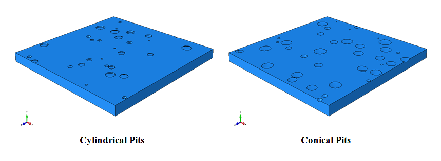
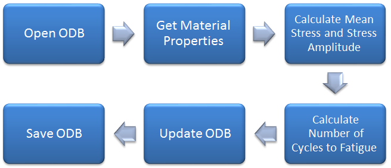

# Abaqus-Projects

This repository contains a variety of ABAQUS projects codes, including _**Fortran subroutines, Python scripts, and Matlab codes**_, which I've worked on. In the future, I will add more details about them and their related files.

## 
- ## List of Projects:
	- <a href="https://github.com/m-aryayi/Abaqus-Projects/tree/main/ArmitageAndOyen2017"> **ArmitageAndOyen201** </a>

      In this directory, the _USDFLD_ subroutine and MATLAB have been used to simulate the below paper. Matlab file couple with Abaqus and run the input file using the subroutine.
      
      <a href="https://doi.org/10.1016/j.actbio.2016.12.036"> <i> Armitage, O. E., & Oyen, M. L. (2017). Indentation across interfaces between stiff and compliant tissues.</i> </a>

       

       
	- <a href="https://github.com/m-aryayi/Abaqus-Projects/tree/main/DengAndMurakawa2006"> **DengAndMurakawa2006** </a>

      In this directory, the _FILM_ and _DFLUX_ subroutine have been used to simulate the welding process in stainless steel pipe, described in the below paper. I will add the Abaqus files as soon as possible.
      
      
      <a href="https://doi.org/10.1016/j.commatsci.2005.07.007"> _Deng, D., & Murakawa, H. (2006). Numerical simulation of temperature field and residual stress in multi-pass welds in stainless steel pipe and comparison with experimental measurements._ </a>

       
       
       
	- <a href="https://github.com/m-aryayi/Abaqus-Projects/tree/main/PittingCorriosionPlate"> **PittingCorriosionPlate** </a>

      In this directory, scripting is used to model pitting corrosion on a plate. The written code can randomly (size and number) model cylindrical or conical pits on rectangular plates.

      
 
      
      

      
       

       
	- <a href="https://github.com/m-aryayi/Abaqus-Projects/tree/main/Stress-lifeFatigueMethod"> **Stress-lifeFatigueMethod** </a>

      In this directory, scripting is used to calculate the number of cycles to fatigue with stress-life (High Cycle) methods (modified Goodman, Gerber, Soderberg). This script adds the contour of the number of cycles to Odb file with the below path.

      
 
      
      

      
      An example model and its result, which is validated using the below reference, exists in the directory.
      
      <i> Budynas, R. G., & Nisbett, J. K. (2014). Shigley’s Mechanical Engineering Design (10th Edition).</i>
      
       

	- <a href="https://github.com/m-aryayi/Abaqus-Projects/tree/main/ZhouEt_al2017"> **ZhouEt_al2017** </a>

      In this directory, the _USDFLD_ subroutine has been used to simulate the below paper. The VUSDFLD subroutine is available for future simulation development in Abaqus/Explicit. If you want to use this project in a different Abaqus version, download the file and run it as below in the terminal:   

          abaqus job=Job-Validation input=Job-Validation user=USDFLD_CapModel.for
 	  
      <a href="https://doi.org/10.1016/j.powtec.2016.09.061"> <i> Zhou, M., Huang, S., Hu, J., Lei, Y., Xiao, Y., Li, B., ... & Zou, F. (2017). A density-dependent modified Drucker-Prager Cap model for die compaction of Ag57. 6-Cu22. 4-Sn10-In10 mixed metal powders.</i> </a>
